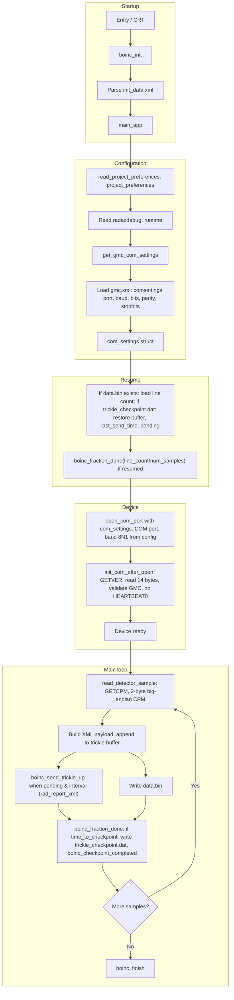

# Phase 5: End-to-End Data Flow (GMC300.exe)

This document describes the **end-to-end data flow** of GMC300.exe from startup to finish: how configuration, the GMC-300 device, and server reporting fit together. It synthesizes Phase 2 (configuration), Phase 3 (device protocol), and Phase 4 (server communication).

---

## 1. Scope

- **Purpose:** Single reference for the full application flow—startup, config, device I/O, sampling loop, trickle-up, checkpoint, and finish.
- **Audience:** Reimplementation, porting, debugging, or recovery of the original C++.
- **Related docs:** Phase 2 (config), Phase 3 (protocol), Phase 4 (server); BOINC wrapper reference.

---

## 2. High-Level Flow

```
BOINC init → main_app:
  1. Init prefs/config (init_data + gmc.xml)
  2. Resume data.bin (line count) and trickle checkpoint (trickle_checkpoint.dat → restore buffer, last_send_time, pending)
  3. Open COM until ready
  4. Main loop: GETCPM → build payload → buffer trickle → send when pending ≥ 3 and ≥ 20 min (rad_report_xml) / data.bin → fraction_done → checkpoint (incl. write trickle_checkpoint.dat)
  → boinc_finish
```

**In words:** After BOINC provides init data, **main_app** runs in four phases: (1) read project preferences and COM config, (2) restore data.bin line count and trickle state from trickle_checkpoint.dat if resuming, (3) open and initialize the GMC-300, (4) main loop that reads CPM, buffers and sends trickle-up (multiple `<sample>` per send when conditions are met), writes data.bin, reports fraction_done (recovered on resume), and at checkpoint time persists trickle state to trickle_checkpoint.dat before **boinc_checkpoint_completed**. Finally **boinc_finish**.

---

## 3. Flow Diagram (Mermaid)



---

## 4. Stage-by-Stage Summary

| Stage | What happens | Phase reference |
|-------|----------------|------------------|
| **1. BOINC init** | Entry → CRT → **boinc_init**; BOINC provides init data (e.g. init_data.xml). | Phase 2 |
| **2. Parse init_data** | **parse_init_data_file** parses init_data; **project_preferences** block is stored for later use. | Phase 2 §2, §5 |
| **3. main_app – config** | **read_project_preferences**(init_data, `"project_preferences"`) → read **radacdebug**, **runtime**. num_samples = (runtime_minutes×60 − RUNTIME_BUFFER_SEC) / EFFECTIVE_SEC_PER_SAMPLE so wall time stays within given runtime (EFFECTIVE_SEC_PER_SAMPLE = SAMPLE_INTERVAL_SEC + GETCPM delays ≈ 41 s; RUNTIME_BUFFER_SEC = 120). Then **get_com_port_number** → load **gmc.xml** (section **gmc**), read **comsettings** → **portnumber** (1–99). | Phase 2 §4, §5, §6 |
| **4. Open COM** | **open_com_port**(port) → `COM%d`, 57600 8N1, timeouts 1 s + 100 ms/byte. | Phase 3 §2, §6 |
| **5. Init device** | **init_com_after_open**: send **GETVER** → read 14 bytes → validate **"GMC"**; HEARTBEAT0 is not sent. | Phase 3 §3, §5, §6 |
| **6. Main loop** | For each sample (up to num_samples): **read_detector_sample** → GETCPM → 2 bytes → CPM. Wait **SAMPLE_INTERVAL_SEC** (30 s). Build XML, append to trickle buffer. **boinc_send_trickle_up**(`"rad_report_xml"`, buffered xml) when pending ≥ **TRICKLE_MIN_PENDING** (or _DEBUG) and ≥ **TRICKLE_MIN_INTERVAL_MIN** (or _DEBUG) since last send; after send keep last sample in buffer. Write **data.bin** (one line per sample); **boinc_fraction_done**((data_bin_line_count + total_samples_done)/num_samples). If **boinc_time_to_checkpoint**, write **trickle_checkpoint.dat** (last_send_time, pending, buffer) then **boinc_checkpoint_completed**. On resume, fraction_done is reported immediately as data_bin_line_count/num_samples after loading data.bin. | Phase 3 §4; Phase 4 §2, §3, §4 |
| **7. Finish** | **boinc_finish**(status). | BOINC API |

---

## 5. Data Flow (Config → Device → Server)

| Data | Source | Consumer | Role |
|------|--------|----------|------|
| **project_preferences** | init_data.xml (BOINC) | main_app | radacdebug, runtime → num_samples |
| **portnumber** | gmc.xml (gmc → comsettings → portnumber) | open_com_port | COM port name (COM%d) |
| **CPM** | GMC-300 (GETCPM, 2 bytes big-endian (MSB first)) | Payload builder | Counts per minute in XML (and possibly data.bin) |
| **rad_report_xml payload** | Built in app (XML string) | boinc_send_trickle_up | BOINC client sends to Radioactive@home |
| **Identity (auth)** | init_data (authenticator, hostid, etc.) | BOINC client | Used when client sends trickles; not in app payload |

---

## 6. Critical-Path Function Order (Execution Summary)

Function order along the main path:

1. **Entry / CRT** → **main_app**
2. **boinc_init** (or boinc_init_options)
3. **parse_init_data_file** — init_data.xml → project_preferences stored
4. **read_project_preferences**(init_data, `"project_preferences"`)
5. **get_config_value** / **get_config_cstr** / **parse_int_cstr** — radacdebug, runtime
6. **get_com_port_number** — load gmc.xml, read comsettings/portnumber
7. **open_com_port**(port)
8. **init_com_after_open** — GETVER, validate "GMC" (no HEARTBEAT0)
9. **Loop:** **read_detector_sample** → build XML, append to trickle buffer → **boinc_send_trickle_up**("rad_report_xml", buffer) when pending and interval conditions met → data.bin write → **boinc_fraction_done** → if **boinc_time_to_checkpoint** write trickle_checkpoint.dat then **boinc_checkpoint_completed**
10. **boinc_finish**

Supporting functions (see Phase 2–4): read_project_preferences, get_config_value, get_config_int, get_config_cstr, config_string_empty, release_config_value, load config from file (gmc.xml), parse_init_data_file.

---

## 7. References

- **Phase docs** are the main reference: Phase 2 (config flow and keys), Phase 3 (serial commands and parsing), Phase 4 (trickle-up and data.bin).
- **This document** is the end-to-end summary; §6 gives the function order. Reference behaviour of the original program (trickle, data.bin, sample_type, resume): docs/original-program-behaviour.md.
- **Project application sources:** [Application sources](http://radioactiveathome.org/boinc/forum_thread.php?id=99) (Radioactive@home forum) — official radac source releases for reference.

---

## 8. Timing and trickle (recovered constants)

| Constant | Role |
|----------|------|
| **SAMPLE_INTERVAL_SEC** (30) | Seconds between CPM reads (GETCPM); drives data.bin line rate. |
| **EFFECTIVE_SEC_PER_SAMPLE** (~41) | SAMPLE_INTERVAL_SEC + GETCPM_DELAY_BEFORE_SEND_SEC + GETCPM_WAIT_AFTER_SEND_SEC; used to compute num_samples so wall time fits runtime. |
| **RUNTIME_BUFFER_SEC** (120) | Seconds reserved for startup (COM open, GETVER); subtracted from runtime before dividing by EFFECTIVE_SEC_PER_SAMPLE. |
| **TRICKLE_MIN_PENDING** / **TRICKLE_MIN_INTERVAL_MIN** | Send when pending samples ≥ threshold (3 normal, 2 debug) and ≥ N minutes since last send (20 min normal, 10 min debug). Trickle state (buffer, last_send_time, pending) is written to **trickle_checkpoint.dat** at BOINC checkpoint and restored on resume. |

---

*Phase 5 deliverable: end-to-end data flow for GMC300.exe (config → device → server), critical-path summary, timing/trickle constants, and reference to Phase 2–4.*
